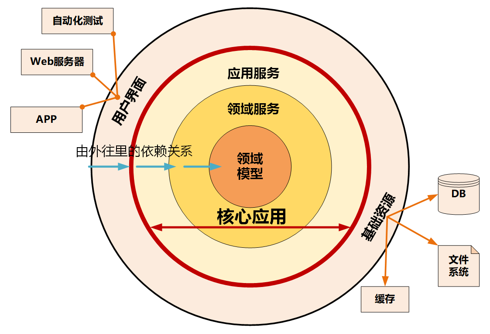
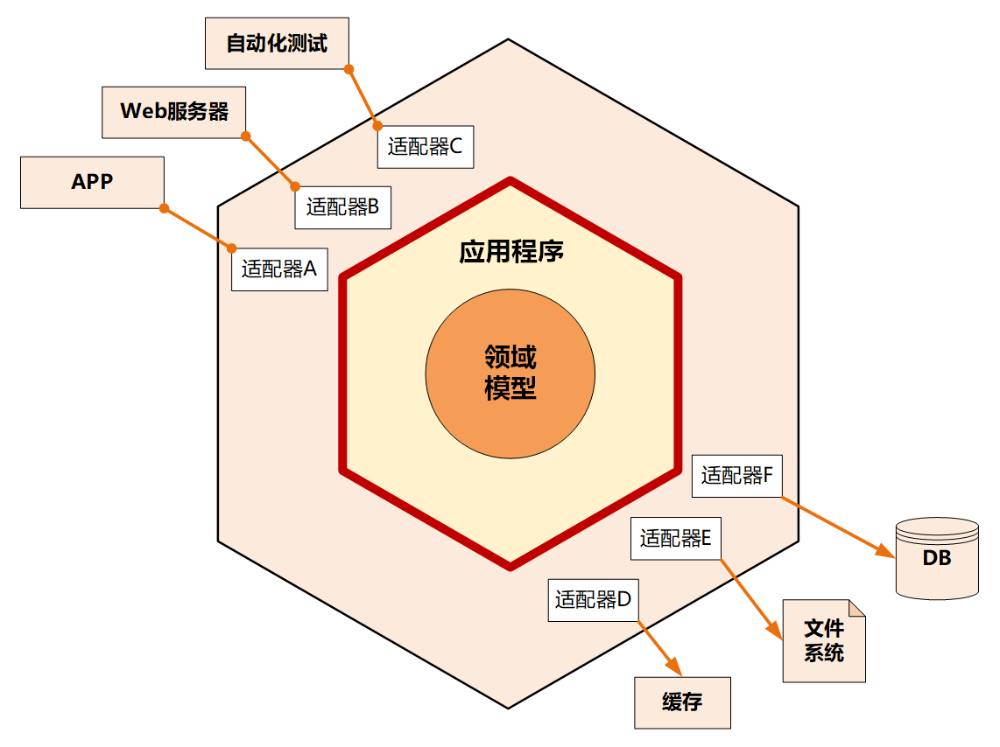
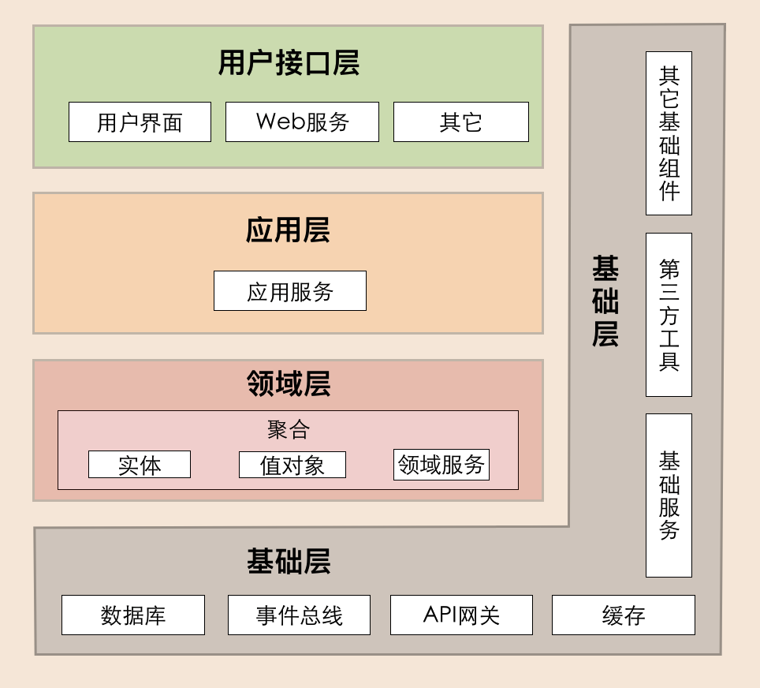
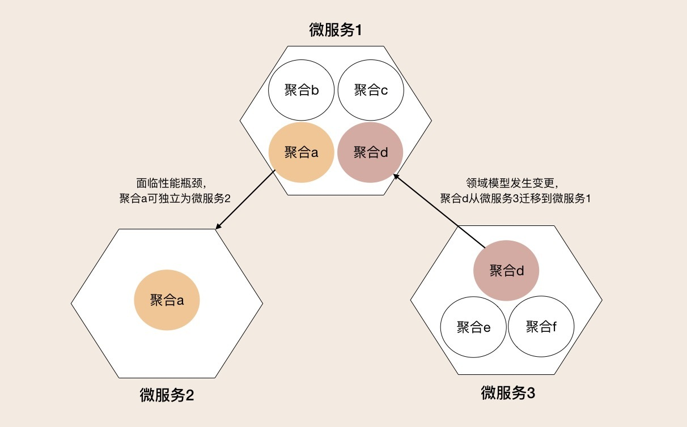
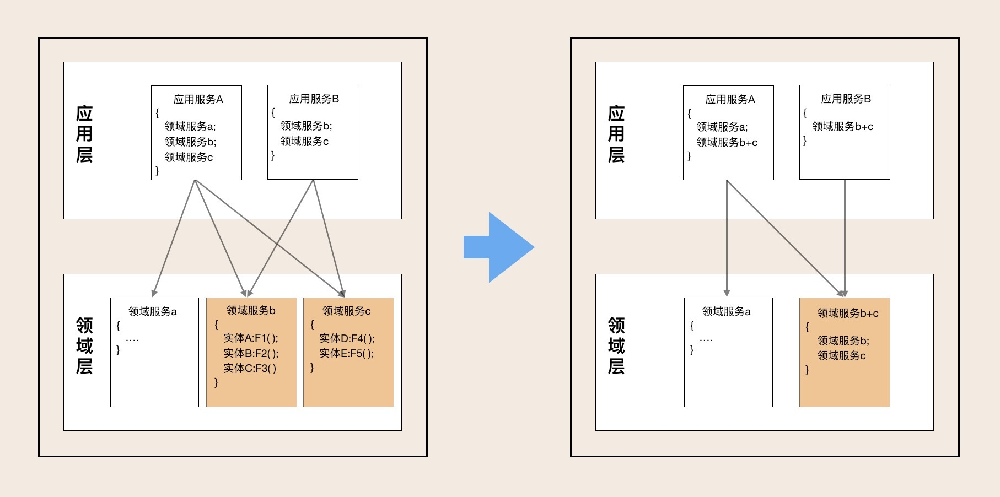
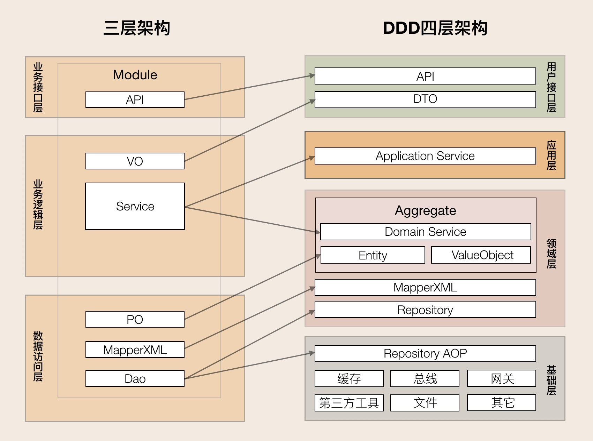
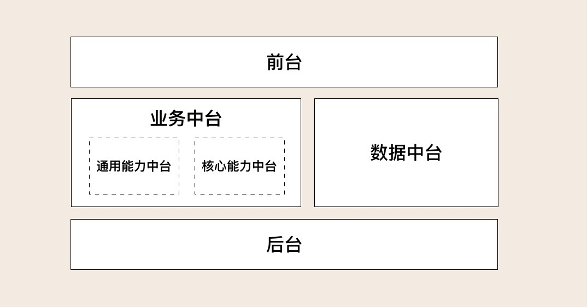
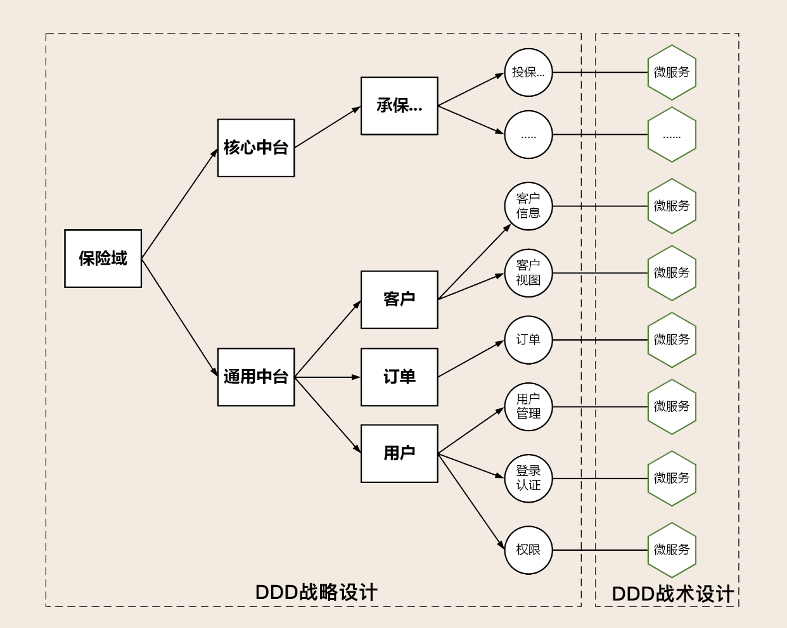

# DDD领域驱动设计

## 基础

> DDD 核心思想是通过领域驱动设计方法定义领域模型，从而确定业务和应用边界，保证业务模型与代码模型的一致性。

### DDD 的战略设计和战术设计

1. 战略设计主要从业务视角出发，建立业务领域模型，划分领域边界，建立通用语言的限界上下文，==限界上下文可以作为微服务设计的参考边界==。
2. 战术设计则从技术视角出发，侧重于领域模型的技术实现，完成软件开发和落地，包括：聚合根、实体、值对象、领域服务、应用服务和资源库等代码逻辑的设计和实现。

### 子域划分：

1. 核心域决定产品和公司核心竞争力。
2. 通用域没有太多个性化的诉求，同时被多个子域使用的通用功能子域（认证、权限）。
3. 支撑域是必需的，但既不包含决定产品和公司核心竞争力的功能，也不包含通用功能的子域（数据字典）。

### 限界上下文

==限界就是领域的边界，而上下文则是语义环境。==

用来封装通用语言和领域对象，提供上下文环境，保证在领域之内的一些术语、业务相关对象等（通用语言）有一个确切的含义，没有二义性。

通过事件风暴来划分限界上下文，在事件风暴过程中，通过团队交流达成共识的，能够简单、清晰、准确描述业务涵义和规则的语言就是通用语言。

> 领域边界就是通过限界上下文来定义的，限界上下文就是微服务的边界。我们将限界上下文内的领域模型映射到微服务，就完成了从问题域到软件的解决方案。

### 实体和值对象

1. 实体和值对象是组成领域模型的基础单元。
2. 实体类通常采用充血模型
3. 实体对象都有唯一的 ID
4. 实体与数据库对象存在映射但不限于一一对应的关系
5. 值对象本质上就是一个集合

在领域建模时，我们可以将部分对象设计为值对象，保留对象的业务涵义，同时又减少了实体的数量；在数据建模时，我们可以将值对象嵌入实体，减少实体表的数量，简化数据库设计。

### 聚合与聚合根

1. 聚合

   由业务和逻辑紧密关联的实体和值对象组合而成的，聚合是数据修改和持久化的基本单元，每一个聚合对应一个仓储，实现数据的持久化。

   > ==聚合有一个聚合根和上下文边界==
   >
   > 跨多个实体的业务逻辑通过领域服务来实现，跨多个聚合的业务逻辑通过应用服务来实现。

2. 聚合根

   > 聚合根的主要目的是为了避免由于复杂数据模型缺少统一的业务规则控制，而导致聚合、实体之间数据不一致性的问题。
   >
   > 聚合根也称为根实体，它不仅是实体，还是聚合的管理者。

### 聚合的设计原则

1. 在一致性边界内建模真正的不变条件。
2. 设计小聚合。
3. 通过唯一标识引用其它聚合。
4. 在边界之外使用最终一致性。
5. 通过应用层实现跨聚合的服务调用。

### 聚合的设计步骤

1. 采用事件风暴，根据业务行为，梳理出在投保过程中发生这些行为的所有的实体和值对象。
2. 从众多实体中选出适合作为对象管理者的根实体，也就是聚合根。
3. 根据业务单一职责和高内聚原则，找出与聚合根关联的所有紧密依赖的实体和值对象。构建出 1 个包含聚合根（唯一）、多个实体和值对象的对象集合，这个集合就是聚合。
4. 在聚合内根据聚合根、实体和值对象的依赖关系，画出对象的引用和依赖模型。
5. 多个聚合根据业务语义和上下文一起划分到同一个限界上下文内。

### 基础总结

* 聚合的特点：==高内聚、低耦合==，它是领域模型中最底层的边界，可以作为拆分微服务的最小单位。
* 聚合根的特点：聚合根是实体，有实体的特点，具有全局唯一标识，==有独立的生命周期==。一个聚合只有一个聚合根，聚合根在聚合内对实体和值对象采用直接对象引用的方式进行组织和协调，聚合根与聚合根之间通过 ID 关联的方式实现聚合之间的协同。
* 实体的特点：有 ID 标识，通过 ID 判断相等性，ID 在聚合内唯一即可。状态可变，它依附于聚合根，其生命周期由聚合根管理。
* 实体一般会持久化，但与数据库持久化对象不一定是一对一的关系。实体可以引用聚合内的聚合根、实体和值对象。
* 值对象的特点：无 ID，不可变，无生命周期，用完即扔。值对象之间通过属性值判断相等性。它的核心本质是值，是一组概念完整的属性组成的集合，用于描述实体的状态和特征。值对象尽量只引用值对象。

==在聚合设计时，工厂模式和仓储模式会经常使用，复杂对象使用工厂优化创建==

## 进阶

### 领域事件

一种事件发生后通常会导致进一步的业务操作，在 DDD 中这种事件被称为领域事件，是业务流程的一个步骤，采用领域事件的最终一致性。

#### 领域事件与微服务的设计

1. 微服务内领域事件

   ​		领域事件发生后完成事件实体构建和事件数据持久化，发布方聚合将事件发布到事件总线，订阅方接收事件数据完成后续业务操作。

   ​		微服务内应用服务，可以通过跨聚合的服务编排和组合，以服务调用的方式完成跨聚合的访问，这种方式通常应用于实时性和数据一致性要求高的场景。这个过程会用到分布式事务，以保证发布方和订阅方的数据同时更新成功。

2. 微服务之间的领域事件

   ​		跨微服务的领域事件会在不同的限界上下文或领域模型之间实现业务协作。

   ​		跨微服务的事件机制要总体考虑事件构建、发布和订阅、事件数据持久化、消息中间件，甚至事件数据持久化时还可能需要考虑引入分布式事务机制等。

#### 领域事件总体架构

1. 事件构建和发布：事件唯一标识、发生时间、事件类型和事件源

2. 事件数据持久化

   * 持久化到本地业务数据库的事件表中，利用本地事务保证业务和事件数据的一致性。

   * 持久化到共享的事件数据库中。跨库操作，需要分布式事务机制来保证业务和事件数据的强一致性，结果就是会对系统性能造成一定的影响。

3. 事件总线 (EventBus)

   如果是微服务内的订阅者（其它聚合），则直接分发到指定订阅者

   如果是微服务外的订阅者，将事件数据保存到事件库（表）并异步发送到消息中间件

   如果同时存在微服务内和外订阅者，则先分发到内部订阅者，将事件消息保存到事件库（表），再异步发送到消息中间件

4. 消息中间件

5. 事件接收和处理

### 微服务架构模型

#### 整洁架构

> 整洁架构最主要的原则是依赖原则，它定义了各层的依赖关系，越往里依赖越低，代码级别越高，越是核心能力。外圆代码依赖只能指向内圆，内圆不需要知道外圆的任何情况。

#### 六边形架构

==端口适配架构==，应用是通过端口与外部进行交互的。

### DDD分层架构

1. 用户接口层

   用户接口层负责向用户显示信息和解释用户指令。（包括用户、程序、自动化测试和批处理脚本）

2. 应用层

   应用服务是在应用层的，它负责服务的组合、编排和转发，负责处理业务用例的执行顺序以及结果的拼装，以粗粒度的服务通过 API 网关向前端发布。还有，==应用服务还可以进行安全认证、权限校验、事务控制、发送或订阅领域事件等==。

3. 领域层

   领域层主要体现领域模型的业务能力，它用来表达业务概念、业务状态和业务规则。

4. 基础层

   基础层是贯穿所有层的，它的作用就是为其它各层提供通用的技术和基础服务，包括第三方工具、驱动、消息中间件、网关、文件、缓存以及数据库等。比较常见的功能还是提供数据库持久化。

#### 分层架构原则

> 每层只能与位于其下方的层发生耦合。

严格分层架构中，领域服务只能被应用服务调用，而应用服务只能被用户接口层调用，服务是逐层对外封装或组合的，依赖关系清晰。

#### DDD 分层架构与架构演进

1. 微服务架构演进

   以聚合为基础单元，完成领域模型和微服务架构的演进。聚合可以作为一个整体，在不同的领域模型之间重组或者拆分，或者直接将一个聚合独立为微服务。

2. 微服务内服务的演进

   在微服务内部，实体的方法被领域服务组合和封装，领域服务又被应用服务组合和封装。

   减少了服务的数量，也减轻了上层服务组合和编排的复杂度，实现高内聚。

#### 三层架构到DDD架构

三层架构向 DDD 分层架构演进，主要发生在业务逻辑层和数据访问层。

DDD 分层架构在用户接口层引入了 DTO，给前端提供了更多的可使用数据和更高的展示灵活性。

DDD 分层架构的数据库等基础资源访问，采用了仓储（Repository）设计模式，通过依赖倒置实现各层对基础资源的解耦。

仓储又分为两部分：仓储接口和仓储实现。仓储接口放在领域层中，仓储实现放在基础层。原来三层架构通用的第三方工具包、驱动、Common、Utility、Config 等通用的公共的资源类统一放到了基础层。

### 中台

==共享、联通、融合和创新==

1. 对前台业务的快速响应能力；
2. 企业级复用能力；
3. 从前台、中台到后台的设计、研发、页面操作、流程服务和数据的无缝联通、融合能力。

> 业务中台的建设可采用领域驱动设计方法，通过领域建模，将可复用的公共能力从各个单体剥离，沉淀并组合，采用微服务架构模式，建设成为可共享的通用能力中台。

### DDD、中台和微服务的关系

==中台是抽象出来的业务模型，微服务是业务模型的系统实现，DDD 作为方法论可以同时指导中台业务建模和微服务建设==

* DDD的本质

  当然每个企业的领域定位和职责会有些不一样，那在核心域的划分上肯定会有一定差异。因此，当你去做领域划分的时候，请务必结合企业战略，这恰恰也体现了 DDD 领域建模的重要性。

* 中台的本质

  中台的本质其实就是提炼各个业务板块的共同需求，进行业务和系统抽象，形成通用的可复用的业务模型，打造成组件化产品，供前台部门使用。

#### DDD、中台和微服务的协作模式

1. 按照业务流程或者功能属性、集合，将业务域细分为多个中台，再根据功能属性或重要性归类到核心中台或通用中台。核心中台设计时要考虑核心竞争力，通用中台要站在企业高度考虑共享和复用能力。
2. 选取中台，根据用例、业务场景或用户旅程完成事件风暴，找出实体、聚合和限界上下文。依次进行领域分解，建立领域模型。
3. 以主领域模型为基础，扫描其它中台领域模型，检查并确定是否存在重复或者需要重组的领域对象、功能，提炼并重构主领域模型，完成最终的领域模型设计。
4. 选择其它主领域模型重复第三步，直到所有主领域模型完成比对和重构。
5. 基于领域模型完成微服务设计，完成系统落地。

* DDD 战略设计包括上述的第一步到第四步，主要为：业务域分解为中台，对中台归类，完成领域建模，建立中台业务模型。

* DDD 战术设计是第五步，领域模型映射为微服务，完成中台建设。

