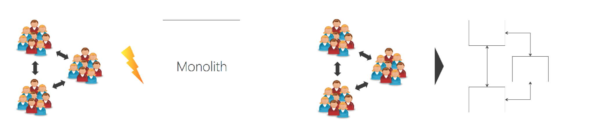

# 微服务架构

## 什么是微服务

> **微服务是一种通过多个小型服务组合来构建单个应用的架构风格，这些服务围绕业务能力而非特定的技术标准来构建。各个服务可以采用不同的编程语言，不同的数据存储技术，运行在不同的进程之中。服务采取轻量级的通信机制和自动化的部署机制实现通信与运维**。

* 一组小型服务
* 独立进程
* 轻量通信
* 自动部署
* 围绕业务能力

> loosely coupled service oriented architecture with bounded context
>
> 基于有界上下⽂的，松散耦合的⾯向服务的架构

微服务的优势与挑战

优势：

* 强模块化边界
* 独立化部署
* 技术多样性

挑战：

* 分布式复杂性
* 最终一致性
* 运维复杂性
* 测试复杂性

> 设计系统的组织，其产⽣的架构设计等价于组织间的沟通结构

##康威法则

设计系统的组织，其产⽣的架构设计等价于组织间的沟通结构。

## 微服务与生产力

架构的研发百人左右可以考虑微服务

微服务本质上是一种组织架构对重组