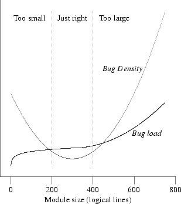

# unix编程艺术-设计-模块化

> ### *Keeping It Clean, Keeping It Simple*
>
> There are two ways of constructing a software design. One is to make it so simple that there are obviously no deficiencies; the other is to make it so complicated that there are no obvious deficiencies. The first method is far more difficult.
>
> 软件设计有两种构建方式。一个是简单，没有明显的不足；另一个是让它变得复杂，没有明显的缺陷。第一种方法要困难得多。

## 封装和优化模块大小

模块化代码的首要也是最重要的质量是*封装*。

模块之间的API具有双重作用。

* 在实现层面，它们作为模块之间的扼流点，防止每个模块的内部泄漏。
* 在设计层面，真正定义了架构的是API。

缺陷计数和密度与模块大小的定性图

所以，更少的缺陷来自于更好的模块化，更好的模块化来自于更高的封装。

> Brooks's Law predicts that adding programmers to a late project makes it later. More generally, it predicts that costs and error rates rise as the square of the number of programmers on a project.
>
> 布鲁克斯定律预测，在后期项目中添加程序员会使项目晚点。更一般地说，它预测成本和错误率随着项目程序员人数的平方而上升。

###紧凑性和正交性

* 紧凑性

  紧凑使用愉快，但显而易见存在学习成本。

* 正交性

  正交性是最重要的属性之一，可以帮助使复杂的设计变得紧凑。在纯粹的正交设计中，操作没有副作用；每个操作（无论是API调用、宏调用还是语言操作）只更改一件事，而不影响其他操作。更改您所控制的任何系统的每种属性的方法只有一个。

  > *重构*的概念最初是“极端编程”学派的一个明确想法，它与正交性密切相关。重构代码就是在不改变其可观察行为的情况下改变其结构和组织。

* 单点真理原则-SPOT原则

  他们的“不要重复自己”规则是：每一项知识都必须在系统中具有*单一*、明确、权威的代表性。

* 紧凑强大的单中心

  最有效的工具都是围绕一些单一强大算法的直接翻译的薄包装。

  避免启发式方法-经验法则导致一种概率正确但不一定正确的解决方案。

  通过数学模型和完善的算法去证明其合理性而非经验法则。

* > a special transmission, outside the scriptures

  笔者的理解，不携带假设，从零开始。摘要，简化，归一概而论，扔掉一切先入为主的思想。

## 软件的分层

### 自上而下与自下而上

* 自下而上，从具体到抽象
* 自上而下，从抽象到具体

> 纯粹自上而下地编程，您可能会发现自己处于一种不舒服的境地，即应用程序逻辑想要的域原语与您实际实现的域原语不匹配。另一方面，如果你纯粹自下而上地编程，你可能会发现自己做了很多与应用程序逻辑无关的工作。

### 胶水层/粘合层

当自上而下和自下而上的驱动器碰撞时，应用逻辑的顶层和域原语的底层必须由一层粘合逻辑进行阻抗匹配。

试图围绕自己的一组数据结构或对象将其组织成中间层，最终可能会有*两*层胶水

> 薄胶原理可以被视为分离规则的完善。策略（应用程序逻辑）应该与机制（域原语）完全分离，

## 共享库

库分层的一个重要形式是*插件*

Unix编程风格强调模块化和定义良好的API的一个结果是，将程序分解为连接库集合的胶水位，特别是共享库

## Unix和面向对象语言

> 所有OO语言都表现出一些将程序员吸入过度分层陷阱的趋势。
>
> OO抽象的另一个副作用是优化机会趋于消失。

对于性能使用薄胶，对于领域使用OO。

## 模块化编码

* 在函数原型之后立即写出那条单行注释。
* *神奇的数字七+/-2*人类在短期记忆中可以保存的离散信息项数量为7个，加减2个，[认知心理学的基础论文]。