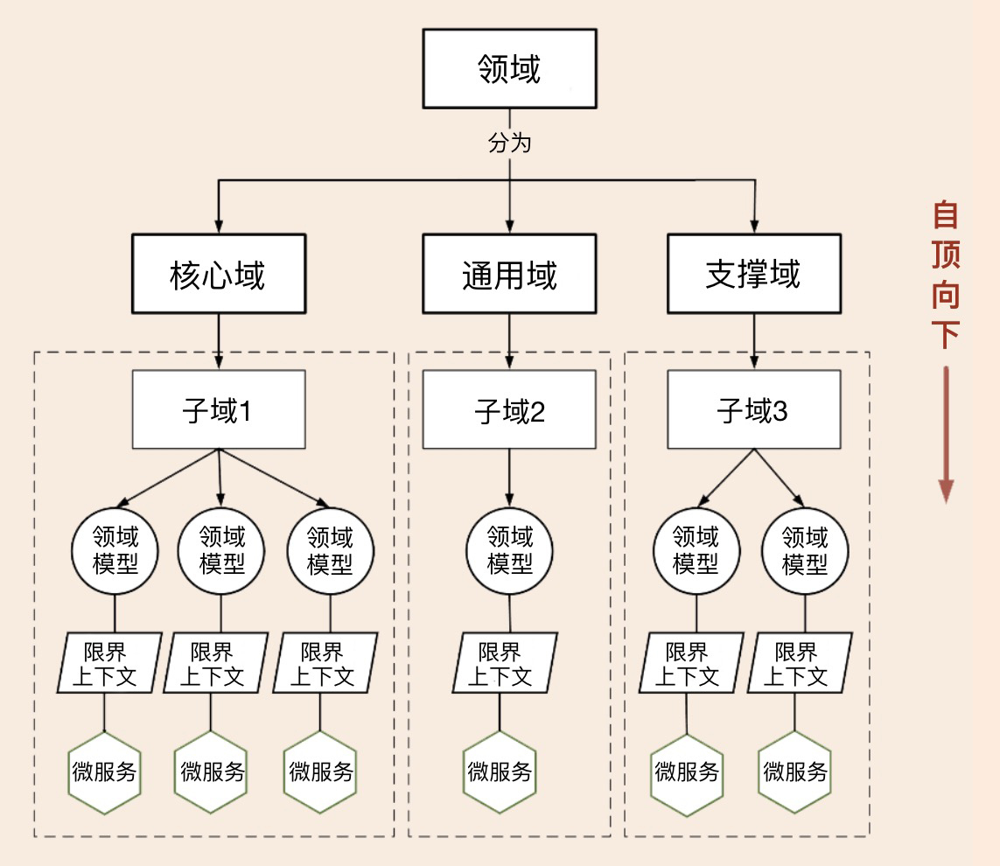

# DDD领域驱动设计实践

## DDD重构

### 传统企业应用分析

1. 核心能力的重复建设。
2. 通用能力的重复建设。
3. 业务职能的分离建设。
4. 互联网电商平台和传统核心功能前后完全独立建设。

> 将重复的需要共享的通用能力、核心能力沉淀到中台，将分离的业务能力重组为完整的业务板块，构建可复用的中台业务模型。

### 构建中台业务模型的方法论

#### 自顶向下的策略

> 自顶向下的策略适用于全新的应用系统建设，或旧系统推倒重建的情况

1. 将领域分解为子域，子域可以分为核心域、通用域和支撑域；
2. 对子域建模，划分领域边界，建立领域模型和限界上下文；
3. 根据限界上下文进行微服务设计。

#### 自底向上的策略

> 适用于遗留系统业务模型的演进式重构

1. 锁定系统所在业务域，构建领域模型。
2. 对齐业务域，构建中台业务模型。
3. 中台归类，根据领域模型设计微服务。

## 领域建模

​		事件风暴是一项团队活动，领域专家与项目团队通过头脑风暴的形式，罗列出领域中所有的领域事件，整合之后形成最终的领域事件集合，然后对每一个事件，标注出导致该事件的命令，再为每一个事件标注出命令发起方的角色。命令可以是用户发起，也可以是第三方系统调用或者定时器触发等，最后对事件进行分类，整理出实体、聚合、聚合根以及限界上下文。而==事件风暴正是 DDD 战略设计中经常使用的一种方法，它可以快速分析和分解复杂的业务领域，完成领域建模。==

1. 产品愿景

   ​		产品愿景的主要目的是对产品顶层价值的设计，使产品目标用户、核心价值、差异化竞争点等信息达成一致，避免产品偏离方向。

2. 业务场景分析

   场景分析时会产生很多的命令和领域事件。

3. 领域建模

   1. 从命令和事件中提取产生这些行为的实体。
   2. 根据聚合根的管理性质从七个实体中找出聚合根。
   3. 划定限界上下文，根据上下文语义将聚合归类。

4. 微服务拆分与设计

   ==在微服务拆分与设计时，我们不能简单地将领域模型作为拆分微服务的唯一标准，它只能作为微服务拆分的一个重要依据。==

## 微服务设计与拆分

### 微服务设计原则

1. 要领域驱动设计，而不是数据驱动设计，也不是界面驱动设计。
2. 要边界清晰的微服务，而不是泥球小单体。
3. 要职能清晰的分层，而不是什么都放的大箩筐。
4. 要做自己能 hold 住的微服务，而不是过度拆分的微服务。

### 微服务拆分因素

1. 基于领域模型
2. 基于业务需求变化频率
3. 基于应用性能
4. 基于组织架构和团队规模
5. 基于安全边界
6. 基于技术异构等因素

